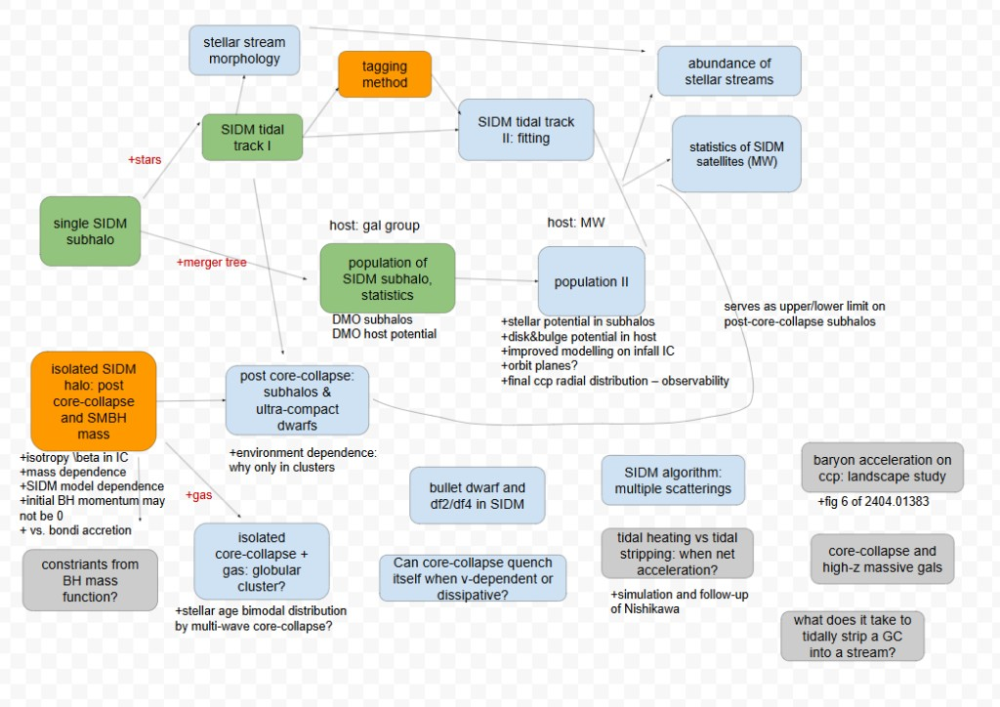
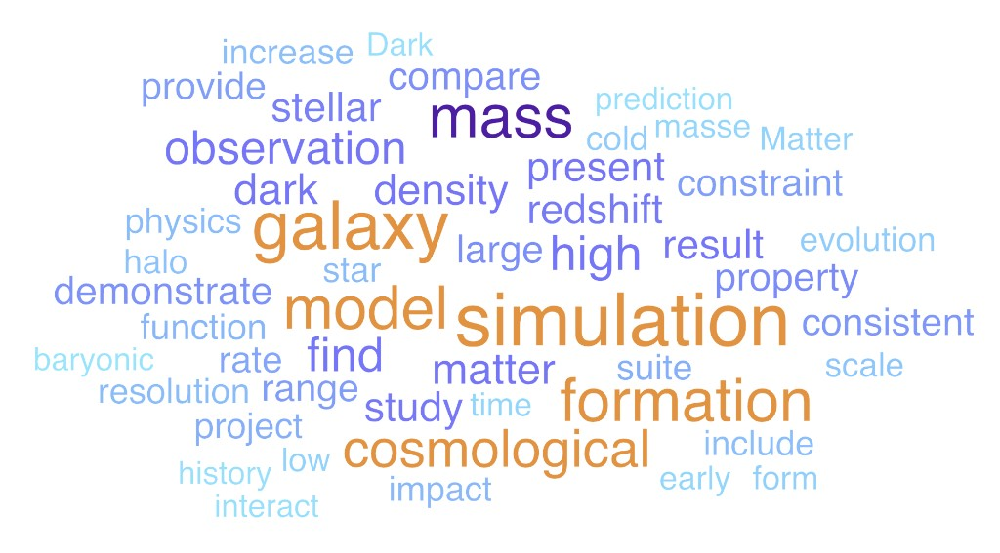

# 个人学术网站建设方案

作者：Zhichao "Carton" Zeng（Postdoctoral Associate, Texas A&M University）
版本：v0.1（草案，待人工确认后进入实现阶段）

参考样本站点：
1. Jiaxuan Li — https://jiaxuanli.me/
2. Ethan O. Nadler — https://eonadler.github.io/research.html
3. Xuejian Shen — https://xuejianshen.github.io/personal-website/
4. Fangzhou Jiang — https://www.fzjiang.com/

---

## 0. 一句话背景

你的研究方向（SIDM、暗晕/子晕演化、矮星系）与 Nadler、Shen、Jiang 高度重合。这意味着：**这几个站是你所在同行圈子的展示惯例**，借鉴结构不会显得违和，但要避免与他们的版式过于雷同（尤其 Jiang / Shen 都很简约，容易撞款）。

网站上**不主动强调与他们的合作关系**——合作论文本身在 Publications 页按 CV 分类如实列出即可，不做额外的关系陈述。

---

## 1. 建设流程（Pipeline）

```
CV (main (1).tex)      4 个同行站点 URL      research roadmap 手绘图
        │                     │                        │
        ▼                     ▼                        ▼
① CV 内容抽取          ② 对标分析（§2）        ②' roadmap 清理与节点映射
   (publications/talks        │                （去掉未发表/私人注记，
    直接写进页面；            │                 节点 → 论文对应关系，§5.1）
    CV 本身以 PDF 上传)       │                        │
        └──────────────┬──────┴────────────────────────┘
                        ▼
           ③ 设计简报（本文档 §3-§9）
           栏目 / Research 页结构 / 内容映射 / 视觉 / 验收
                        ▼
           ④ 生成站点骨架 + 用 JSON 填内容
           （建议 Astro 或 Next.js 静态导出，roadmap 用内联 SVG）
                        ▼
           ⑤ 人工校对
           发表年份/作者序/链接/图片版权/口吻是否浮夸
```

**关键原则：** ①②③ 是决策层，产出的是文本/JSON，不涉及代码；④才开始生成实现代码；⑤是强制人工闸门，不能跳过。本文档就是 ①②③ 的产出，可直接喂给下一步做实现的模型/agent。

---

## 2. 对标网站分析

| 站点 | 与你的领域重合度 | 导航栏目 | 首页/入口结构 | 特色元素 | 视觉风格 | 可借鉴点 | 不建议照搬 |
|---|---|---|---|---|---|---|---|
| **Jiaxuan Li** | 中（矮星系/近场宇宙学，非 SIDM） | About / CV / Research（子栏目）/ Talks / Blog / Software / Misc（摄影/烹饪） | 大头像 + 一段夹杂个人色彩的自我介绍 + "Recent News" 时间线 | 个人成长背景（甘肃定西、业余天文爱好者）+ 兴趣爱好板块，人情味强 | 简洁学术风，但用第一人称讲故事 | News 时间线（发表/加入新单位/获奖实时更新，招委和合作者常看这个）；用一两句"非典型经历"建立记忆点 | Blog / Software / 摄影栏目——除非你真的会持续更新，否则空栏目比没有更差 |
| **Ethan Nadler** | 高（SIDM、矮星系、暗物质小尺度结构，直接合作者） | Research / CV / Group / Publications / Mentoring & Teaching / Outreach & Service / Media / Interdisciplinary | Research 页面即核心入口，按 3 大主题（Galaxy Formation / Dark Matter / Near-field Cosmology）组织，每个主题下用"Key Questions"列表 | "Products" 板块：把长期项目（COZMIC、SIDM Concerto、Milky Way-est、Symphony）做成带配图+一段话+关键论文链接的模块，而不是简单罗列论文 | 内容密度高、结构化，面向同行读者而非大众科普 | **"Key Questions" 组织法**——比罗列论文更能体现你在想什么问题；**把长期项目/代码包装成独立模块**（你有 SIDM subhalo 演化系列论文，可以包装成一个类似的"项目"） | 栏目非常多（Group/Outreach/Media/Interdisciplinary），你目前独立学生组和媒体报道较少，全搬会显得栏目空 |
| **Xuejian Shen** | 高（SIDM 理论与数值模拟，直接合作者） | Home / About me / Research（子栏目）/ Publications / Press | About + 研究方向列表 + 大量模拟可视化视频/GIF | "Research Highlights" 统计块（100+ publications / 3100+ citations / h-index 31）；模拟可视化占大量篇幅 | 视觉冲击力强，用现成模板（HTML5 UP），成果导向 | **统计数字模块**放在显眼位置（你 CV 里已经算好了 14 篇/428 引用，直接复用）；如果你有模拟可视化图/动图（Gadget2/Arepo 出图），值得做一个可视化展示区 | 大段视频/动图对静态站加载和维护成本高，先做图片版，动图后续再加 |
| **Fangzhou Jiang** | 高（SIDM 半解析模型，直接合作者） | Home / Research / CV / Contact / More | 一段履历式自我介绍（时间线写法：现职→历任职位→博士→本科） | 3 个研究项目做成"图+一段话"的卡片（SatGen / Galaxy-halo connection / Galaxy morphology），不逐篇列论文 | 极简、克制，几乎没有多余栏目 | **履历式开场段**（一句话讲清楚现在是谁、师承、方向演变）；**用少数几个"研究故事"代替论文列表**做首页 Research，比逐条列 arXiv 更好读 | 栏目过少（无 Talks/Mentoring），你有不少 plenary talk 和带教经历，值得体现，不必学他省略 |

**共同规律（4 站都有）：**
- 首页都在开头几句话内交代：现职 + 机构 + 一句话研究方向 + 师承（advisor）。
- 都有独立的 Publications 或论文导流入口（Google Scholar / ADS / ORCID 链接必备）。
- Research 页面都不是"论文摘要合集"，而是按主题/项目重新组织过的叙事。
- 都没有花哨的动效或首页大图轮播，克制是学术站的默认审美。

**本站的主动偏离**：四站的 Research 页都是**并列**的主题/项目块（Nadler 的三大主题、Jiang 的三张项目卡、Shen 的兴趣点列表）。本站改为**承接式**组织——用一张 roadmap 展示工作之间的推进关系（见 §5）。这是本方案唯一有意不跟随样本站惯例的地方，也是差异化的来源。

---

## 3. 你的定位（Positioning）

- **一句话定位**：研究自相互作用暗物质（SIDM）晕/子晕的引力热演化及其在矮星系、substructure lensing、Local Group 中的观测印记的天体物理学家。
- **目标读者优先级**：① 招聘委员会/合作者（faculty search, postdoc 网络）② 同行（同一 SIDM/矮星系小圈子，可能直接点进来找论文或代码）③ 潜在学生了解带教经历。
- **与参照站点的差异化（核心）**：你的一作工作构成**一条连续推进的研究线**——从单个 SIDM 子晕的演化，逐步加入 stars / merger tree / gas / SMBH 等要素向外扩展，每一步都建立在前一步之上。四个样本站的 Research 页都是"并列的几个研究主题"（Nadler 三大主题、Jiang 三个项目、Shen 四个兴趣点），**没有一个展示了研究之间的承接关系**。这是你独有的叙事优势，应该用一张 schematic 图直接展示出来（见 §5）。
- **注意**：这条差异化必须**配一句话文字说明**。读者不会自动从流程图里读出"这是一条连续的线"，图上方需要一句显式的定位句，例如："My work follows a single thread: starting from the evolution of an individual SIDM subhalo and successively adding stars, hierarchical assembly, gas, and black holes."

---

## 4. 信息架构（Sitemap）

在你提出的 `Home / Research / CV / Talks and Slides / Misc and Hobbies` 基础上，**建议增加一个独立的 Publications 页**（理由见 §5.3）：

```
Home
 ├─ 第一人称自我介绍（3 段：研究定位 / SIDM 具体在做什么 / 履历与出身）
 ├─ 1-2 条 News（最新 arXiv / 入职 TAMU）
 └─ Contact：仅邮箱（大字号）+ 带各服务 icon 的 Profile 链接
    （统计条已按你的要求移除——避免绩优主义观感；地址也移除）

Research   ← 网站的核心页面，详见 §5
 ├─ 顶部：research roadmap schematic（可点击，链到本页下方）
 └─ 下方：每篇工作 1-2 张图 + 一段话

Publications
 ├─ 顶部：论文词频 word cloud（作为页面 banner，详见 §6）
 ├─ 三个分组：Leading author (5) / Mentored-student papers (3) / Collaborative work (6)
 ├─ 每条：标题在前（链 arXiv）→ 作者 ≤3 人 + et al.（本人加粗；排第 3 之后用 incl. Z. C. Zeng）
 └─ 不显示引用数；以 INSPIRE-HEP 为参考记录并视觉突出

Talks and Slides
 ├─ 按 CV 的三组主题分组（与 Research 的叙事线呼应）
 └─ 提供 slides PDF 下载（plenary talk 优先：KITP Dark Matter 2024、Flatiron Galactic Frontiers）

CV
 └─ **仅 PDF**（内嵌预览 + 下载按钮），由现有 main (1).tex 编译，不做网页版渲染
    → Mentoring / Teaching / Awards / Skills 只存在于 PDF 中，网站不另设页面

Misc and Hobbies
 └─ 学术之外的内容，详见 §5.5
```

**Contact 放 Home 页可行**，但建议同时在**每一页的 footer 放邮箱**——同行从 Slack/Twitter 链接直接落到 Research 页时，不必再返回首页找联系方式。

**建议不做的栏目**：Blog、Software、Group、Media、Outreach（除非计划持续维护，否则空栏目反而降低可信度）。

---

## 5. Research 页面设计（本站重点）

### 5.1 顶部 roadmap schematic

原始手绘图已存档于 `docs/assets/research-roadmap-source.png`（含未上线的计划部分，**仅作内部参考**）。



**范围**：只包含已发表 + 即将上线的工作（即你原图中的绿色 + 橙色方块）。原图中的蓝色（计划中）和灰色（待定想法）方块**不上线**——它们暴露了未来的研究计划，且对读者而言是无法验证的承诺。

同时需要移除原图里的**私人研究笔记**，例如 `+isotropy \beta in IC`、`+mass dependence`、`+ vs. bondi accretion`、`+fig 6 of 2404.01383` 这类 TODO 注记。这些在公开页面上会被读作"想法还没做完"。

**必须保留**：箭头上的 `+stars` / `+merger tree` / `+gas` 标注。这些正是"一条线逐步扩展"叙事的可视化载体，是整张图的价值所在。

**方块文字的取舍**：你说想放"文章标题 + 几个词的核心描述"，但你的论文标题都很长（例如 *Core-collapse, evaporation and tidal effects: the life story of a self-interacting dark matter subhalo*），直接放进方块会撑爆图形、让整张图无法阅读。建议**两层处理**：

- 方块内：3-6 词的短句柄 + 年份，例如 `Life story of a SIDM subhalo (2022)`
- 完整标题 + 期刊 + arXiv 号：放在下方对应的详细内容区块（以及 hover tooltip）

**实现方式**：不要用 PNG + image map。建议**内联 SVG**，每个节点包成 `<a href="#paper-slug">`，文字用真实的 SVG `<text>`（可缩放、可选中、可被搜索引擎索引、可跟随主题配色）。

**移动端**：原图宽高比约 1.4:1 且信息密集，在手机上文字会小到不可读。两种可选方案：
- (a) 窄屏时把 SVG 放进横向可滚动容器 + 提示"scroll to explore"
- (b) 窄屏时改为纵向的节点列表（保留同样的链接和 `+stars` 之类的衔接标注）

推荐 (b)，阅读体验更好，但实现成本略高。

### 5.2 下方详细内容区块

每篇工作一个 block，结构统一：

```
[锚点 id="paper-slug"]
完整论文标题（链接到 arXiv / 期刊）
作者列表（你的名字加粗）· 期刊 · 年份
1-2 张图（配简短 caption，说明图在讲什么）
一段话（3-5 句）：这篇在问什么问题、做法、结论、以及它如何接上前一篇
```

最后一句"如何接上前一篇"很重要——它是把 roadmap 的箭头翻译成文字，让不看图的读者也能理解这条线。

**图片来源提示**：从已发表论文取图时，注意期刊版权（多数 AAS / APS 期刊允许作者在个人网站复用自己的图，但建议在 caption 标注来源论文）。

### 5.3 建议：不做 Selected Papers 区块，Publications 单独成页

你在犹豫的两个选项，建议这样处理：

**不要在 roadmap 和详细内容之间插入 Selected Papers 列表。** 因为下方的详细内容区块本身就已经是"精选论文"了——中间再放一个论文列表，等于同一批论文在同一页出现两次，读者会困惑两者的区别。roadmap 已经承担了"导航 + 概览"的功能，不需要再加一层列表。

**Publications 应该单独成页。** 理由：

1. roadmap 只覆盖你的一作研究线。CV 里 14 篇论文中，**3 篇 mentored-student + 6 篇 collaborative 共 9 篇不在这条线上**，如果没有独立页面，这 9 篇在网站上就没有归属。
2. 作为 postdoc 有 3 篇 mentored-student 论文是很实在的带教信号，值得单独呈现，混在 Research 叙事里会被淹没。
3. Publications 是学术站被访问最多的页面之一，招委常直接找它，独立 URL 更方便被直接引用。
4. 你的 2019 年 JCAP 中微子论文（一作）在这条 SIDM 线之外，Publications 页是它自然的归属。

**衔接做法**：Research 页最后一行放一个链接 `Full publication list →` 指向 Publications 页。

### 5.4 可选：研究计划的处理

你决定 roadmap 只放已发表工作，这个判断是对的（图会更干净可信）。但对 faculty application 而言，展示"研究纲领的走向"是有加分的。建议的折中：**Research 页最底部加一小段纯文字**（3-4 句）的 *Where this is going*，用文字概述下一步方向（例如 population-level statistics、stellar streams 的可观测印记），**不再画第二张图**。这样既保留顶部图的干净，又传达了研究纲领感。

### 5.5 Misc and Hobbies

在天文/物理圈子里做这个栏目完全不出格（Jiaxuan Li 就有 Photography / Cooking）。几个约束：

- **只做一页**，不设子栏目；篇幅上不应压过 Research。
- **只放你自己的照片/内容**，注意肖像与版权。
- 避免政治、宗教等争议性内容——招委也会看这一页。
- **只放你真的会更新的东西**。长期不更新的爱好页会显得网站被弃置。
- 这部分内容 CV 里没有，需要你自己提供素材（内容清单 + 图片）。

---

## 6. 论文词频 Word Cloud

借鉴来源：Xuejian Shen 站点的词云（参考图存档于 `docs/assets/wordcloud-reference-shen.png`）。



### 6.1 为什么这个元素放在你身上会更有效

参考图的问题是**词太通用**——`galaxy` / `mass` / `simulation` / `model` / `formation` / `cosmological` 几乎是所有星系形成方向的共同词汇，看完并不知道作者具体做什么。你的语料恰恰相反：14 篇论文集中在一条窄线上，词云会自然浮现出 `self-interacting dark matter` / `core-collapse` / `gravothermal` / `subhalo` / `tidal` / `dwarf` / `cross-section` 这类**高辨识度**词汇。**你的研究线越窄，词云的信息量越大**，所以这个元素对你比对 Shen 更划算。

### 6.2 放哪里：Publications 页顶部（推荐）

| 候选位置 | 评价 |
|---|---|
| **Publications 页顶部 banner** | **推荐。** ① 词云由论文语料生成，放在论文页，取材范围与页面范围一致，逻辑最诚实；② Publications 是全站最枯燥的页面（14 条列表），最需要一个视觉元素；③ 它天然充当"进入列表前的一眼概览" |
| Home 页 | 次选。Home 缺视觉锚点，词云能补，但 Home 的核心是那句精确的一句话定位，词云是模糊表达，放上去会与之争夺注意力；且 Home 已有头像 + 统计条 + News，再加会显得拥挤 |
| **Research 页顶部** | **不推荐。** 会与 roadmap 直接竞争。roadmap 是精确、可导航、承接式叙事的核心资产；词云是模糊装饰。装饰不应该和全站最强的内容并列摆放 |
| CV 页 / Misc 页 | 不合适 |

若你希望 Home 也有视觉元素，建议放头像 + roadmap 的缩略图（链到 Research），而不是词云。

### 6.3 语料范围与权重（已定）

- 语料：**全部 14 篇**的全文（PDF 提取，参考文献部分已剥离）；早期版本仅用标题 + 摘要，现已升级为全文。
- 权重：**一作论文词频 ×1.5**，mentored-student 与 collaborative 论文 ×1。
- 效果：既覆盖完整的研究面，又让一作那条 SIDM 主线的词汇在视觉上占主导。
- 最终词表经过逐词人工评审（不只靠脚本规则）：重复项合并（如 velocity-dependent cross section 拆归 velocity-dependent 与 cross section、gravothermal 系列归并）、无独立含义的词剔除（sloan / dark / mass / survey 等）。评审结论固化在脚本的 `REVIEWED_OUT` 表中，每项带剔除理由；以后加入摘要语料后浮现的新词照此流程再审。

### 6.4 质量要点（这一步决定词云是加分还是减分）

参考图暴露了三类典型缺陷，实现时必须避免：

1. **通用学术动词/名词占据了大量视觉权重**。参考图里 `provide` / `present` / `find` / `demonstrate` / `compare` / `include` / `study` / `result` / `range` / `increase` / `consistent` 这些词信息量为零，却占了近一半篇幅。需要一份**扩展停用词表**，除英文常规停用词外，额外剔除学术套话动词与量词。
2. **同一个词的变体没有合并**。参考图同时出现 `Dark` 和 `dark`、`Matter` 和 `matter`、`mass` 和 `masse`（明显的词形还原错误），看起来很粗糙。需要：统一大小写 + 单复数归并 + lemmatize，并人工检查一遍结果。
3. **多词术语被拆散**。`self-interacting dark matter`、`core collapse`、`gravothermal catastrophe`、`tidal stripping`、`dwarf galaxy`、`cross section` 必须作为**整体 token**（bigram/trigram 白名单），拆成单词后信息就没了——这是你的词云能否胜过参考图的关键。

### 6.5 实现规范

- **词数上限 ~40–60**，超过就变成视觉噪音。
- **配色（按你的要求改为多色）**：五个色相的小调色板（以 `headingBlue` 为锚，加钢青/水鸭青/琥珀/紫），明度仍随词频排名变化（大词最深）。首位词固定用主色。**全部词横排**（曾试过部分竖排，后按你的要求撤销）。随机种子固定，重跑结果可复现。
- **离线生成、产物入库**：用脚本（Python `wordcloud` 或 D3）生成一次，把 **SVG** 产物提交进仓库，不在运行时计算。SVG 清晰可缩放、可跟随主题配色。
- **v1 不做交互**（不做点击词过滤论文列表）。收益小、成本高，留待以后。
- **可访问性**：词云是装饰性元素，需配 alt text，且**不能承载任何仅存在于此处的信息**。
- **手机端**：等比缩放即可，但需检查最小字号是否仍可读；必要时窄屏时减少词数。

---

## 7. 内容映射规则（CV → 网站，哪些照搬、哪些允许润色）

| 网站板块 | 数据来源 | 处理方式 |
|---|---|---|
| Publications 列表、引用数、机构、时间线 | `main (1).tex` 逐字段抄录 | **禁止模型改写事实**（作者序、年份、期刊、arXiv 号必须原样） |
| CV 页 | 编译好的 PDF，由你上传 | 网站只做内嵌预览 + 下载，不解析内容 |
| roadmap 节点的短句柄 | 你的原图标签 + 论文标题 | LLM 起草，**必须由你确认**每个节点对应哪篇论文 |
| Research 每篇工作的段落 | 论文摘要 + 你的口述 | **允许 LLM 组织语言**，但"如何接上前一篇"这句必须由你确认 |
| Home 自我介绍段 | CV Professional Experience + Education + 你补充的个人语境 | **允许 LLM 起草，人工改到"听起来像你"** |
| News | CV 时间节点（入职 TAMU、最新 arXiv） | 半自动，后续手动更新 |
| Talks and Slides | CV Presentations 原文 + slides 文件 | 照搬，slides 需你提供 PDF |
| Misc and Hobbies | **CV 中无此信息，需你另外提供** | 全部由你提供素材 |
| Word cloud | 论文标题 + 摘要（需抓取或由你提供） | 脚本离线生成，**词表结果需你人工过一遍**（§6.4） |

---

## 8. 视觉方向

- **基调**：克制、学术、不使用大图轮播或强动效（4 个样本站一致）。
- **配色**：可延续 CV 里已经定义好的 `headingBlue (RGB 30,56,115)` 作为主色，保持 CV 和网站视觉一致性，形成个人识别色。
- **字体**：衬线体做标题（呼应 CV 的 Charter 字体气质），正文用无衬线保证网页可读性。
- **布局参考优先级**：Jiang 的极简 + Shen 的统计数字模块。Research 页不采用 Nadler 的并列主题式组织，改用你自己的 roadmap 承接式组织（§5）。**不建议**照搬 Shen 的大量视频/动图（先上线图片版，未来有可视化产出再加）。
- **roadmap 配色**：原图的绿/橙/蓝/灰四色语义在上线版本里只剩两类（已发表 / 即将上线）。建议改为**同色系深浅两级**（主色 `headingBlue` 的深浅），比原图的多色更克制，也更符合学术站审美。用一个小 legend 说明。
- **技术栈（已定）**：**纯静态 HTML + CSS，无构建步骤**。

  原本计划用 Astro，但本机未安装 Node.js/npm（只有 Brackets 自带的 node v6），且本站规模很小（6 个页面，页面之间几乎没有重复数据需要抽象），静态生成器带来的收益低于它引入的工具链成本。改为手写静态页面的好处：
  - 不需要安装/维护任何工具链，改内容就是改 HTML
  - GitHub Pages 直接托管，无需 CI 构建
  - 以后若要迁移到 Astro，静态 HTML 是最容易迁移的起点

  代价：导航栏与 footer 在 6 个页面中重复（各约 10 行），改导航需同步 6 处。对本站规模是可接受的取舍。

  词云生成用 Python 脚本离线跑（本机 Python 3.10 可用），产物 SVG 提交进仓库。

---

## 9. 验收标准（Definition of Done）

- [ ] 首页 10 秒内能让人看懂：你是谁、在哪、研究什么、师承谁
- [ ] Research 页顶部 roadmap：每个方块可点击并正确跳到下方对应区块
- [ ] roadmap 上已清除所有私人研究笔记与未发表计划（蓝色/灰色方块、`+isotropy \beta in IC` 之类的注记）
- [ ] roadmap 在手机上可读（横向滚动或纵向列表 fallback 生效）
- [ ] Research 页每篇工作都有图 + 一段话，且段落里说明了与前一篇的承接关系
- [ ] Publications 页与 CV 的论文列表、引用数、作者序完全一致（人工核对一遍）
- [ ] 所有 profile 链接（ORCID / InspireHEP / ADS / Google Scholar）可点击且指向正确
- [ ] 每页 footer 都有邮箱
- [ ] 词云里没有通用学术套话词（`present` / `find` / `provide` / `demonstrate` 等）
- [ ] 词云里没有大小写或单复数重复（`dark` vs `Dark`、`halo` vs `halos`）
- [ ] 词云里 `self-interacting dark matter`、`core collapse` 等多词术语保持完整
- [ ] 没有空栏目（导航里出现的每一项都有实质内容，包括 Misc and Hobbies）
- [ ] 站点整体语气克制，没有 LLM 常见的夸张形容词（"revolutionary" "cutting-edge" 等）

---

## 10. 当前进度与待办

> **状态（2026-08-15）**：全站 8 页已建成并完成内容填充，`check_links.py` 全部通过，资源（CV PDF、slides、论文配图、头像、词云）齐全。**仅剩：git 初始化 + 首次 commit，以及 Publications 列表与 CV 的最后人工校对。**

**已建成：**

| 文件 | 状态 |
|---|---|
| `index.html` | ✅ 完成：定位、News、Contact、头像 |
| `research.html` | ✅ 完成：roadmap SVG + 移动端 fallback + 5 个论文区块（图 / lede / bullet 齐全） |
| `publications.html` | ✅ 完成：14 篇三类分组 + 词云 banner |
| `talks.html` | ✅ 完成：11 场报告分组 + 5 个 slides |
| `cv.html` | ✅ 完成：PDF 内嵌 + 下载 |
| `misc.html` | ✅ 完成：hobby + side quests |
| `misc-thoughts.html` | ✅ 完成：三想法 + 难点 + 开放问题 |
| `dwarf-diversity-tracks.html` | ✅ 完成：2412 全潮汐轨道目录 |
| `assets/img/wordcloud.svg` | ✅ 完成：全文语料、一作 ×1.5、40 词 |
| `scripts/generate_wordcloud.py` | ✅ 完成：全文语料 + 停用词表 + 多词术语白名单 |
| `scripts/check_links.py` | ✅ 通过：8 页所有内部链接 / 锚点 / 资源 resolve |

**已确定：** sitemap（含 Publications 独立页）、CV 用 PDF、词云放 Publications 页顶部、词云语料为全部 14 篇全文且一作 ×1.5、技术栈为无构建静态站。

**仍需你确认（仅剩）：**
1. Publications 列表与 CV 的最后人工校对（作者序、年份、期刊、arXiv 号）——§9 的强制人工闸门
2. `git init` + 首次 commit

**已完成（此前列为待办）：**
- roadmap 节点 → 论文映射（已确认，见 `research.html` 顶部注释）
- 词云词表人工评审（§6.4）
- CV PDF、论文配图、slides、头像、Misc 内容全部到位
